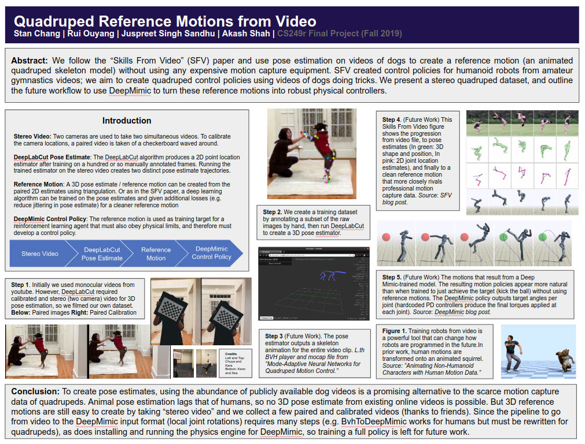

# CS249r Final Project: Quadraped Pose Estimation (formerly DanceDanceRobot) 

For more information, see 

- An (incomplete) blog post at https://www.orangenarwhals.com/2019/12/cs249r-final-project/
- Our final project poster
  
- Our final report, included in the PDF in the home directory

## Contents

- A folder `kara_dog-cs249r-2019-12-10i` 
  - Contains the human-expert annotations for one of our stereo pair of videos of a dog performing tricks
  - Can be imported into .
- A `zip` file containing BVH format Motion Capture files for a dog
  - SOURCED FROM the SIGGRAPH 2018 paper, "Mode-Adaptive Neural Networks for Quadruped Motion Control He Zhang*, Sebastian Starke*, Taku Komura, Jun Saito. ACM Trans. Graph. 37, 4, Article 145.  (*Joint First Authors)". 
  - Data file itself sourced from the git repository: https://github.com/sebastianstarke/AI4Animation, Can also be found at https://3deeplearner.com/siggraph-02/ which contains a good walkthrough / explanation of that paper (actual paper unrelated to our project)

## Recommendations

Take the BVH file and upload it to http://lo-th.github.io/olympe/BVH_player.html
to see a skeleton dog run in your browser!

###  Watch Cute Dog Videos

Our first data set can be found in . Thanks to my family, Yaya, and their dog Kara for these two videos. It's very cute, please do watch.

Our second stereo video, unprocessed / unlabeled, can for now be found at

- https://www.youtube.com/watch?v=HE2yIHwwZyY
- https://www.youtube.com/watch?v=yDAaI81P1c0

As the video files in the original size are quite large, they are not directly included in this repository (will be included after downsizing, cropping, and matching timestamps between the two videos which are about a minute off). Thanks to Kenn and Erica and their dog Aka. More pictures of Aka can be found on his instagram, https://www.instagram.com/akathesailor/ .

## Notes

A huge portion of the work for this project went into trying to get

(which takes a video and produces clean human pose estimates using a combination
of OpenPose and Human Motion Recognition) and
 to run. These efforts
are not really reflected in this repository nor the final report as we were not
able to do so in time and pivoted to the quadraped pose estimation portion of
the project.

## Current Status and Future Work

We are in the middle of annotating sample images of the dog video for training a
DeepPoseCut 2D pose estimator (two of which can be combined to create a 3D pose
estimate. See documentation at the .

We got the GUI for the DeepPoseCut annotation running, which was a pain due to
pywidget's dependencies. Now we are using it to produce annotations. The next
step is to get the training part working, which will involve a lot of GPU etc.
setup on our training computer (right now the annotation software is running
inside a virtual machine as it doesn't require any special deep learning
software).
